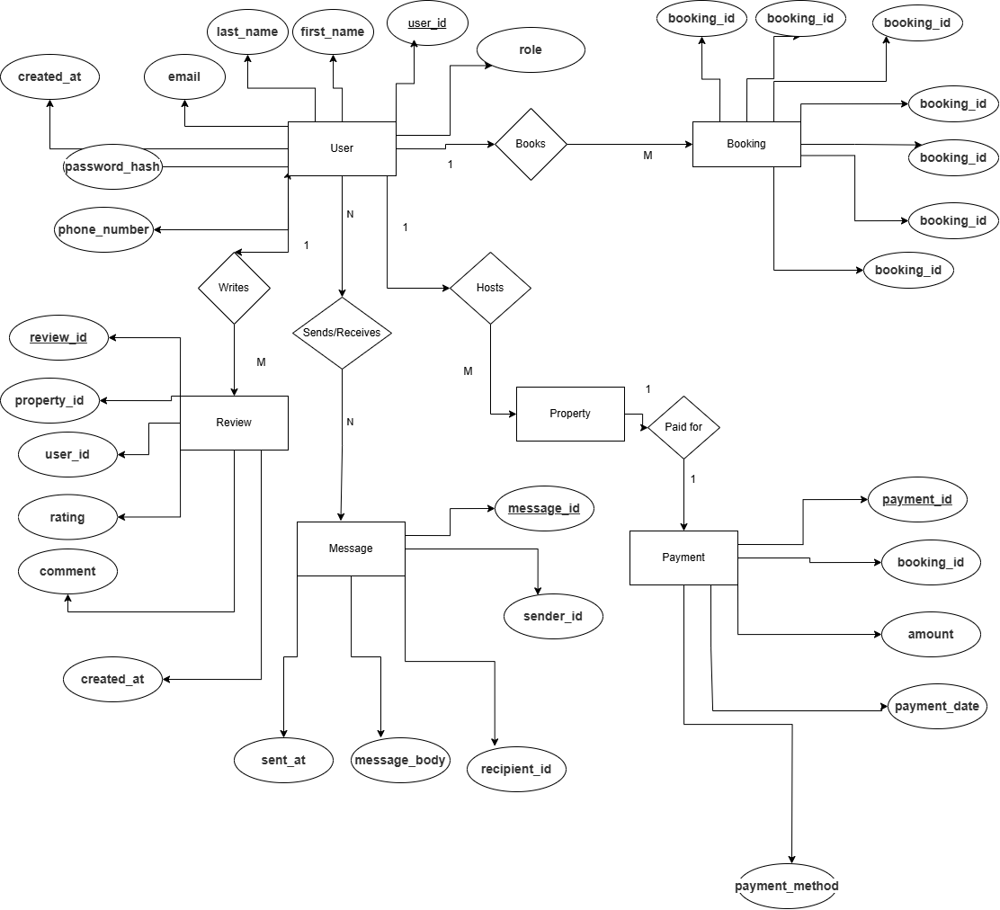

# Entity-Relationship Diagram Requirements

## Project: AirBnB Clone Database

### Entities and Their Attributes

#### User Entity
- `user_id`: Primary Key, UUID, Indexed
- `first_name`: VARCHAR, NOT NULL
- `last_name`: VARCHAR, NOT NULL
- `email`: VARCHAR, UNIQUE, NOT NULL
- `password_hash`: VARCHAR, NOT NULL
- `phone_number`: VARCHAR, NULL
- `role`: ENUM (guest, host, admin), NOT NULL
- `created_at`: TIMESTAMP, DEFAULT CURRENT_TIMESTAMP

#### Property Entity
- `property_id`: Primary Key, UUID, Indexed
- `host_id`: Foreign Key, references User(user_id)
- `name`: VARCHAR, NOT NULL
- `description`: TEXT, NOT NULL
- `location`: VARCHAR, NOT NULL
- `pricepernight`: DECIMAL, NOT NULL
- `created_at`: TIMESTAMP, DEFAULT CURRENT_TIMESTAMP
- `updated_at`: TIMESTAMP, ON UPDATE CURRENT_TIMESTAMP

#### Booking Entity
- `booking_id`: Primary Key, UUID, Indexed
- `property_id`: Foreign Key, references Property(property_id)
- `user_id`: Foreign Key, references User(user_id)
- `start_date`: DATE, NOT NULL
- `end_date`: DATE, NOT NULL
- `total_price`: DECIMAL, NOT NULL
- `status`: ENUM (pending, confirmed, canceled), NOT NULL
- `created_at`: TIMESTAMP, DEFAULT CURRENT_TIMESTAMP

#### Payment Entity
- `payment_id`: Primary Key, UUID, Indexed
- `booking_id`: Foreign Key, references Booking(booking_id)
- `amount`: DECIMAL, NOT NULL
- `payment_date`: TIMESTAMP, DEFAULT CURRENT_TIMESTAMP
- `payment_method`: ENUM (credit_card, paypal, stripe), NOT NULL

#### Review Entity
- `review_id`: Primary Key, UUID, Indexed
- `property_id`: Foreign Key, references Property(property_id)
- `user_id`: Foreign Key, references User(user_id)
- `rating`: INTEGER, CHECK: rating >= 1 AND rating <= 5, NOT NULL
- `comment`: TEXT, NOT NULL
- `created_at`: TIMESTAMP, DEFAULT CURRENT_TIMESTAMP

#### Message Entity
- `message_id`: Primary Key, UUID, Indexed
- `sender_id`: Foreign Key, references User(user_id)
- `recipient_id`: Foreign Key, references User(user_id)
- `message_body`: TEXT, NOT NULL
- `sent_at`: TIMESTAMP, DEFAULT CURRENT_TIMESTAMP

### Relationships

1. **User to Property**: One-to-Many
   - A user (host) can have multiple properties
   - A property belongs to one user (host)

2. **Property to Booking**: One-to-Many
   - A property can have multiple bookings
   - A booking is for one property

3. **User to Booking**: One-to-Many
   - A user (guest) can have multiple bookings
   - A booking belongs to one user (guest)

4. **Booking to Payment**: One-to-Many
   - A booking can have multiple payments
   - A payment is for one booking

5. **Property to Review**: One-to-Many
   - A property can have multiple reviews
   - A review is for one property

6. **User to Review**: One-to-Many
   - A user can write multiple reviews
   - A review is written by one user

7. **User to Message (Sender)**: One-to-Many
   - A user can send multiple messages
   - A message is sent by one user

8. **User to Message (Recipient)**: One-to-Many
   - A user can receive multiple messages
   - A message is received by one user

### Constraints

#### User Table
- Unique constraint on email
- Non-null constraints on required fields (first_name, last_name, email, password_hash, role)

#### Property Table
- Foreign key constraint on host_id referencing User(user_id)
- Non-null constraints on essential attributes (host_id, name, description, location, pricepernight)

#### Booking Table
- Foreign key constraints on property_id referencing Property(property_id)
- Foreign key constraints on user_id referencing User(user_id)
- status must be one of pending, confirmed, or canceled

#### Payment Table
- Foreign key constraint on booking_id referencing Booking(booking_id)

#### Review Table
- Constraints on rating values (1-5)
- Foreign key constraints on property_id referencing Property(property_id)
- Foreign key constraints on user_id referencing User(user_id)

#### Message Table
- Foreign key constraints on sender_id referencing User(user_id)
- Foreign key constraints on recipient_id referencing User(user_id)

### Indexing

#### Primary Keys
- All primary keys are indexed automatically

#### Additional Indexes
- email in the User table
- property_id in the Property and Booking tables
- booking_id in the Booking and Payment tables

### ER Diagram File

### Notes
- UUIDs are used for all primary keys for better scalability and security
- ENUM types are used for fields with a limited set of possible values
- Timestamps are used to track creation and updates of records
- Foreign key constraints ensure referential integrity between tables